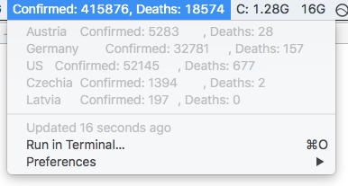

# COVID-19 BitBar Script

This tiny little script pulls the latest data of known novel corona virus cases (see note at the end) from the [Johns Hopkins Universities GitHub repository](https://github.com/CSSEGISandData/COVID-19) and outputs the number of confirmed infections and deaths
* known globally
* separately for a list of countries provided

## Requirements

The script requires just standard tools that should be installed by default on any UNIX-like OS: `curl`, `sed` and `awk`.

## List of countries to print

In the script you will find a regexp `/Germany|Czech|Latvia|Austria|US/` defining the list of countries to list separately. Take a look at [this file](https://raw.githubusercontent.com/CSSEGISandData/COVID-19/web-data/data/cases_country.csv) to see the complete available list.

## Use with BitBar

The script's output is designed to work with BitBar (macOS only). In [Bitbar](https://github.com/matryer/bitbar) it will show the total cases in the title bar and cases for each country separately when clicking on the title bar as shown in the following screenshot.

You would [install this script as a so called BitBar plugin](https://github.com/matryer/bitbar#installing-plugins) by either renaming it to the required file name format, setting the desired refresh time or creating a (sym)link with a name folling that convention. NB: Data in the Johns Hopkins University repository is only refreshed approx. on an hourly basis so excessive refreshes are useless.

## Lastly

Admittedly, even with [the original Lancet Article](https://www.thelancet.com/journals/laninf/article/PIIS1473-3099(20)30120-1/fulltext) it is not entirely clear to me whether Johns Hopkins shows as "confirmed" the known cases of SARS-CoV-2 infections or known COVID-19 cases. If anyone can shed someo light, please raise an issue in this GitHub repo.

Stay safe!

Have fun and feel free to send PRs or and/or raise issues with suggestions.
